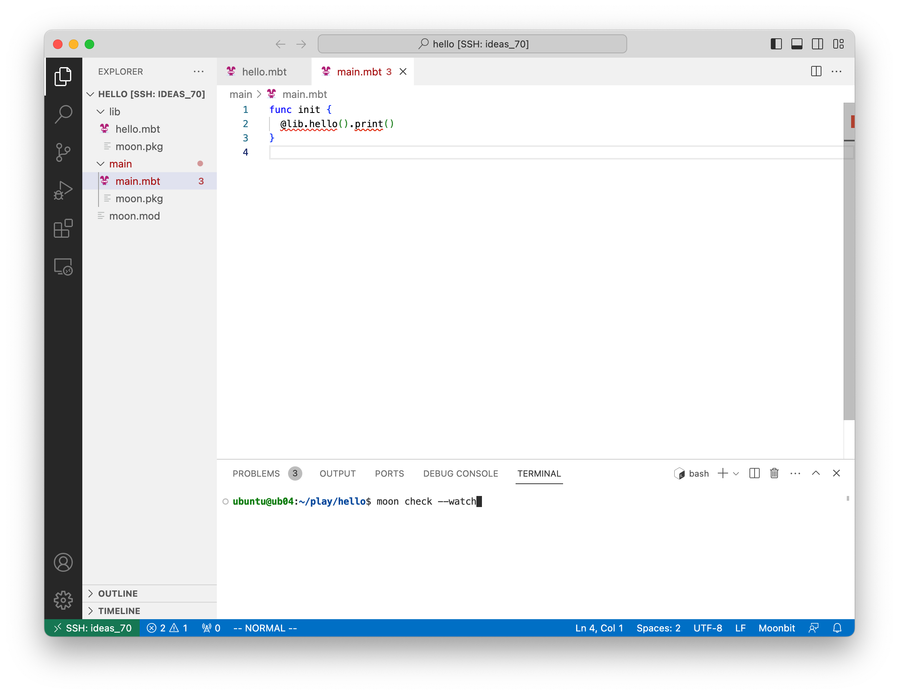
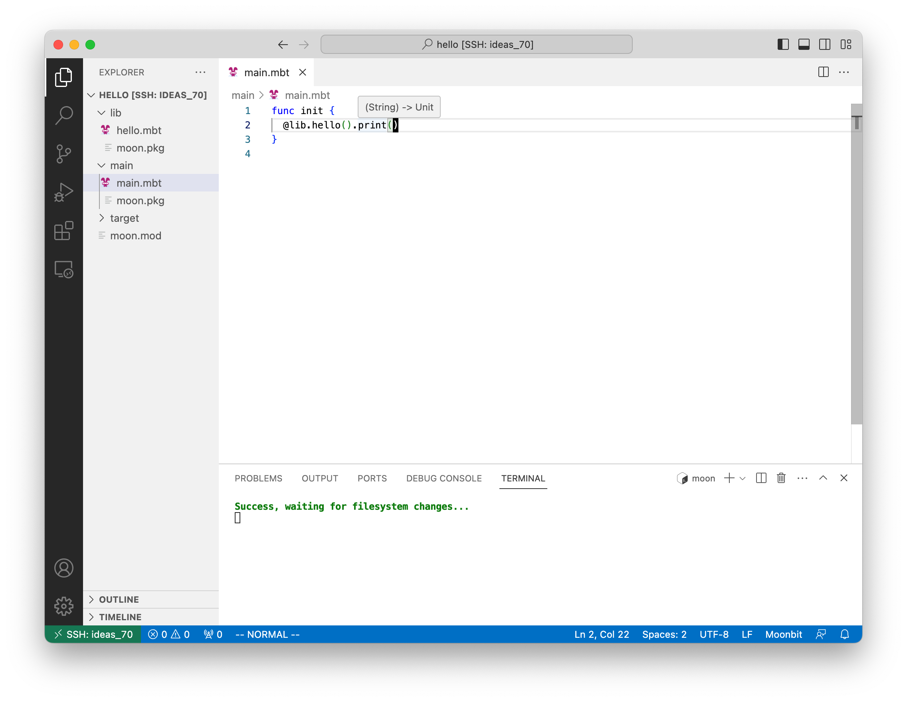

# MoonBit's Build System Tutorial

## Prerequisites

Before you begin with this tutorial, make sure you have installed the following:

1. **MoonBit CLI Tools**: Download it from the <https://www.moonbitlang.com/download/>. This command line tool is needed for creating and managing MoonBit projects.

    Use moon help to view the usage instructions.

    ```bash
    $ moon help
    Moonbit's build system

    Usage: moon <COMMAND>

    Commands:
    build    Build the current package
    check    Check the current package, but don't build object files
    run      Run WebAssembly module
    clean    Remove the target directory
    new      Create a new moonbit package
    bench    Generate build matrix for benchmarking
    fmt      Format moonbit
    version  Print version info and exit
    help     Print this message or the help of the given subcommand(s)

    Options:
    -h, --help  Print help
    ```

2. **Moonbit Language** plugin in Visual Studio Code: You can install it from the VS Code marketplace. This plugin provides a rich development environment for MoonBit, including functionalities like syntax highlighting, code completion, and more.

Once you have these prerequisites fulfilled, let's start building a new module in MoonBit.

## Creating a New Module

To create a new module, use the `moon new hello` command in your terminal:

```bash
$ moon new hello
```

This command will create a new module named `hello`.

## Understanding the Module Directory Structure

After creating the new module, your directory structure should resemble the following:

```bash
.
├── lib
│   ├── hello.mbt
│   └── moon.pkg
├── main
│   ├── main.mbt
│   └── moon.pkg
└── moon.mod
```

Here's a brief explanation of the directory structure:

- `lib` and `main` directories: These are packages in the module. Each package can contain multiple `.mbt` files, which are the source code files in MoonBit language. However, regardless of the number of .mbt files in a package, they all share a common moon.pkg file.

- `*.pkg` files: These are package descriptor files. They define the properties of the package, such as its name and the packages it imports.

- `moon.mod` is used to identify a directory as a MoonBit module. It contains the module's name:

  ```go
  module "hello"
  ```

## Checking Your Project

You can open your project with Visual Studio Code. After you've installed the MoonBit plugin, you can use the `moon check --watch` command in your terminal to automatically check your project.



After executing `moon check --watch`, VS Code should look like this.



## Working with Packages

Our `hello` module contains two packages: `lib` and `main`.

The `lib` package contains a `hello.mbt` file:

```rust
pub func hello() -> String {
    "Hello, world!\n"
}
```

The `main` package contains a `main.mbt` file:

```rust
func init {
  @lib.hello().print()
}
```

To execute your program, specify the path to the `main` package:

```bash
$ moon run main
Hello, world!
```

## Package Importing

In the MoonBit's build system, a module's name is used to reference its internal packages.
To import the `lib` package in `main/main.mbt`, you need to specify it in `main/moon.pkg`:

```go
package main

import "hello/lib"
```

Here, `import "hello/lib"` specifies that the `lib` package from the `hello` module is to be imported.

## Creating and Using a New Package

First, create a new directory named `fib` under `lib`:

```bash
$ mkdir lib/fib
```

Now, you can create new files under `lib/fib`:

`a.mbt`:

```rust
pub func fib(n : Int) -> Int {
  match n {
    0 => 0
    1 => 1
    _ => fib(n - 1) + fib(n - 2)
  }
}
```

`b.mbt`:

```rust
pub func fib2(num : Int) -> Int {
  fn aux(n, acc1, acc2) {
    match n {
      0 => acc1
      1 => acc2
      _ => aux(n - 1, acc2, acc1 + acc2)
    }
  }

  aux(num, 0, 1)
}
```

`moon.pkg`:

```
package fib
```

After creating these files, your directory structure should look like this:

```
.
├── lib
│   ├── fib
│   │   ├── a.mbt
│   │   ├── b.mbt
│   │   └── moon.pkg
│   ├── hello.mbt
│   └── moon.pkg
├── main
│   ├── main.mbt
│   └── moon.pkg
└── moon.mod
```

In the `main/main.pkg` file, add the following line:

```go
import "hello/lib/fib"
```

This line imports the `fib` package, which is part of the `lib` package in the `hello` module. After doing this, you can use the `lib/fib` package in `main/main.mbt`. Replace the file content of `main/main.mbt` to:

```rust
func init {
  let a = @fib.fib(10)
  let b = @fib.fib2(11)
  "fib(10) = \(a), fib(11) = \(b)\n".print()
}
```

To execute your program, specify the path to the `main` package:

```bash
$ moon run ./main
fib(10) = 55, fib(11) = 89
```
